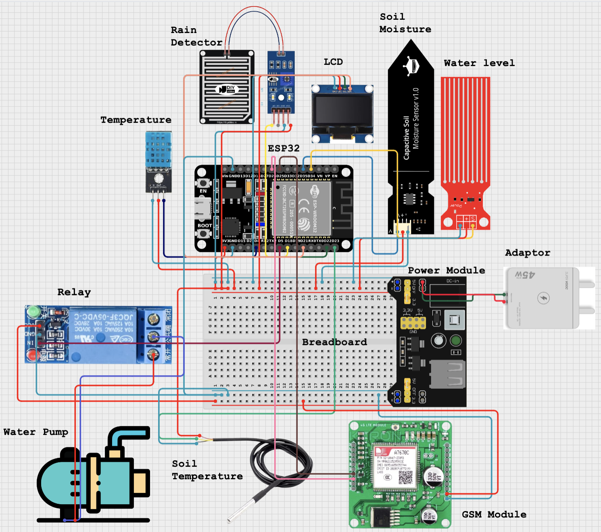

# Smart Farming IoT System

A comprehensive IoT-based smart farming system featuring ESP32 microcontrollers, environmental monitoring sensors, automated irrigation control, and real-time web dashboard. The system uses MQTT communication via HiveMQ Cloud for real-time data exchange and remote control capabilities.

## 🚀 Live Deployments

- **Frontend Dashboard**: [https://smart-farming-dashboard-eosin.vercel.app/](https://smart-farming-dashboard-eosin.vercel.app/)
- **Backend API**: [https://smart-farming-ashy-omega.vercel.app/](https://smart-farming-ashy-omega.vercel.app/)

## 🏗️ System Architecture

### **MQTT Communication Flow**
```
ESP32 (Publisher) → HiveMQ Cloud → Backend (Subscriber) → Supabase PostgreSQL
                ↘               ↗
Frontend (Publisher) → Relay Commands → ESP32 (Subscriber)
```

**MQTT Topics:**
- **Sensor Data**: `sf/esp32-01/sensor` (ESP32 → Backend)
- **Relay Logs**: `sf/esp32-01/relay` (ESP32 → Backend)  
- **Relay Commands**: `sf/devices/relay/command` (Frontend → ESP32)
- **Device Status**: `sf/esp32-01/status` (ESP32 → Backend)

### **Core Components**
1. **ESP32 IoT Device** - Environmental monitoring and actuator control
2. **HiveMQ Cloud** - MQTT broker for real-time communication
3. **Backend API** - Data processing and MQTT subscription (Deployed on Northflank)
4. **Frontend Dashboard** - Real-time monitoring and control interface
5. **Supabase PostgreSQL** - Database for sensor data and logs

## 📱 Technology Stack

### **IoT Device (ESP32)**
- **Platform**: PlatformIO with Arduino Framework
- **Microcontroller**: ESP32 DevKit v1
- **Connectivity**: SIM7670C 4G LTE Module
- **Protocols**: MQTT
- **Libraries**: PubSubClient, DHT sensor, OneWire, U8g2

### **Backend API**
- **Runtime**: Node.js with TypeScript
- **Framework**: Hono (lightweight web framework)
- **Database**: Supabase PostgreSQL with Prisma ORM
- **MQTT Client**: Custom implementation for HiveMQ Cloud
- **Deployment**: Northflank 
- **Authentication**: API key-based security

### **Frontend Dashboard**
- **Framework**: Next.js 14 with App Router
- **Language**: TypeScript
- **Styling**: Tailwind CSS with shadcn/ui components
- **State Management**: TanStack Query (React Query)
- **Charts**: Recharts for data visualization
- **MQTT**: Web-based MQTT client for real-time relay control
- **Deployment**: Vercel

### **Database & Communication**
- **Database**: Supabase PostgreSQL
- **MQTT Broker**: HiveMQ Cloud
- **ORM**: Prisma with TypeScript
- **Real-time**: MQTT for bidirectional communication

## Hardware Components

### Main Controller
- **ESP32 DevKit**: Main microcontroller with WiFi capability
- **SIM7670C GSM Module**: 4G LTE cellular connectivity for remote monitoring

### Sensors
- **DHT22/DHT11**: Temperature and humidity sensor
- **Capacitive Soil Moisture Sensor v1.2**: Analog soil moisture detection with corrosion resistance
- **Rain Detector**: Weather monitoring with digital output
- **DS18B20 Soil Temperature Probe**: Waterproof soil temperature sensor
- **Water Level Sensor**: monitoring to prevent dry running

### Actuators & Output
- **5V Relay Module**: Water pump control switching
- **Water Pump**: 12V submersible or surface pump
- **SSD1306 OLED Display**: 128x64 I2C display for essential system status

### Communication & Power
- **Power Supply Module**: Voltage regulation and distribution via breadboard connection
- **Breadboard**: Prototype connections and signal distribution

## Pin Configuration

| Component | ESP32 Pin | Connection Type |
|-----------|-----------|-----------------|
| DHT22 Sensor | GPIO16 | Digital |
| Soil Moisture | GPIO35 | Analog |
| Rain Detector | GPIO18 | Digital |
| Relay Control | GPIO17 | Digital Output |
| Water Pump 12V | Relay | Switched Load |
| OLED SDA | GPIO21 | I2C |
| OLED SCL | GPIO22 | I2C |
| Soil Temperature (DS18B20) | GPIO23 | OneWire |
| SIM7670C GSM RX | GPIO25 | UART |
| SIM7670C GSM TX | GPIO26 | UART |
| Water Level | GPIO34 | Analog |
| Power Supply Module | Breadboard | VCC/GND Distribution |

## Wiring Diagram



_Complete schematic showing ESP32 connections to sensors (DHT22, soil moisture, rain detector, soil temperature probe), actuators (relay-controlled water pump), display (OLED), SIM7670C GSM module, and power distribution system._

## System Features

### Environmental Monitoring
- Real-time temperature and humidity measurement
- Soil moisture level tracking with capacitive sensor
- Weather monitoring with rain detection
- Soil temperature profiling with waterproof probe
- Water reservoir level monitoring

### Automated Control
- Smart irrigation based on soil moisture thresholds
- Temperature-compensated watering schedules
- Rain detection with automatic irrigation override
- Pump dry-run protection with water level sensing
- Manual override capabilities via web interface

### Data & Connectivity
- Local OLED display for essential system status
- 4G LTE communication via SIM7670C for remote installations
- MQTT real-time communication with HiveMQ Cloud
- Cloud database integration with Supabase PostgreSQL
- RESTful API for third-party integrations

### User Interface
- Modern responsive web dashboard built with Next.js
- Real-time data visualization with Recharts
- Historical data analysis and trends
- Remote pump control via MQTT commands
- Mobile-friendly interface design
- System alerts and notifications

## 🔌 MQTT Communication Details

### **ESP32 Device Communication**
```cpp
// MQTT Topics Used by ESP32
#define SENSOR_TOPIC "sf/esp32-01/sensor"      // Publishes sensor data
#define RELAY_TOPIC "sf/esp32-01/relay"        // Publishes relay status
#define COMMAND_TOPIC "sf/devices/relay/command" // Subscribes to commands
#define STATUS_TOPIC "sf/esp32-01/status"      // Publishes device status
```

### **Sensor Data Payload** (ESP32 → Backend)
```json
{
  "device_id": "esp32-01",
  "timestamp": "2024-01-15T10:30:00Z",
  "soil_moisture": 65.2,
  "soil_temperature": 22.5,
  "air_temperature": 28.3,
  "humidity": 70.1,
  "rain_detected": false,
  "water_level": 85.0
}
```

### **Relay Command Payload** (Frontend → ESP32)
```json
{
  "device_id": "esp32-01",
  "command": "toggle_relay",
  "relay_id": 1,
  "state": "on",
  "duration": 300,
  "timestamp": "2024-01-15T10:30:00Z"
}
```

## API Endpoints

### **Backend REST API**

#### **General Endpoints**
- `GET /api/health` - API health check with database connection status
- `GET /api/db-test` - Database connection test
- `GET /api/info` - API information and endpoint documentation

#### **Sensor Data Endpoints**
- `POST /api/sensor-data` - Create new sensor data entry
- `GET /api/sensor-data` - Retrieve sensor data with pagination
- `GET /api/sensor-data/latest` - Get latest sensor readings
- `GET /api/sensor-data/stats` - Get sensor data statistics
- `GET /api/sensor-data/health` - Sensor data service health check
- `GET /api/sensor-data/:id` - Get specific sensor data by ID
- `DELETE /api/sensor-data/cleanup` - Cleanup old sensor data records

#### **Relay Log Endpoints**
- `POST /api/relay-log` - Create new relay log entry
- `GET /api/relay-log` - Retrieve relay logs with pagination
- `GET /api/relay-log/latest` - Get latest relay log entry
- `GET /api/relay-log/status` - Get current relay status
- `GET /api/relay-log/stats` - Get relay operation statistics
- `GET /api/relay-log/duration` - Get relay operation duration metrics
- `GET /api/relay-log/health` - Relay log service health check
- `POST /api/relay-log/state-change` - Log relay state change event
- `GET /api/relay-log/:id` - Get specific relay log by ID
- `DELETE /api/relay-log/cleanup` - Cleanup old relay log records

#### **MQTT Endpoints**
- `GET /api/mqtt/health` - MQTT connection status and health
- `POST /api/mqtt/publish` - Publish message to specific MQTT topic

### **Real-time Features**
- MQTT subscription for live sensor data updates
- WebSocket-like real-time dashboard updates
- Push notifications for critical alerts
- Live relay control with immediate feedback

## Project Structure

```
smart-farming-iot/
├── README.md
├── assets/
│   └── Wiring_ESP32.png
├── iot-backend/           # Node.js Backend API
│   ├── src/
│   │   ├── controllers/   # API route handlers
│   │   ├── services/      # Business logic & MQTT
│   │   ├── repositories/  # Database operations
│   │   ├── routes/        # Express routes
│   │   └── schemas/       # Validation schemas
│   ├── prisma/           # Database schema & migrations
│   └── package.json
├── iot-dashboard/        # Next.js Frontend
│   ├── src/
│   │   ├── app/          # App router pages
│   │   ├── components/   # React components
│   │   ├── hooks/        # Custom React hooks
│   │   └── lib/          # Utilities & API client
│   └── package.json
└── iot-devices/          # ESP32 PlatformIO Project
    ├── src/              # Main application code
    ├── include/          # Header files
    ├── lib/              # Custom libraries
    └── platformio.ini    # Platform configuration
```

## Power Requirements

- **ESP32**: 3.3V (via onboard regulator from 5V)
- **Sensors**: 3.3V-5V depending on module
- **Relay**: 5V control, switched load up to 250V/10A
- **Water Pump**: 12V DC (via relay switching)
- **OLED Display**: 3.3V I2C
- **SIM7670C GSM**: 3.3V-4.2V via power supply module
- **Power Supply Module**: Breadboard-mounted voltage regulation

## Getting Started

### **ESP32 Setup**
```bash
# Install PlatformIO
pip install platformio

# Navigate to device folder
cd iot-devices

# Upload to ESP32
pio run --target upload
```

### **Backend Setup**
```bash
cd iot-backend
npm install
npm run dev
```

### **Frontend Setup**
```bash
cd iot-dashboard
npm install
npm run dev
```

## Safety Considerations

- Water pump electrical connections must be properly insulated
- Use GFCI protection for outdoor electrical connections
- Ensure proper grounding of all metal components
- Regular inspection of waterproof seals and connections
- Emergency manual shutoff should be accessible
