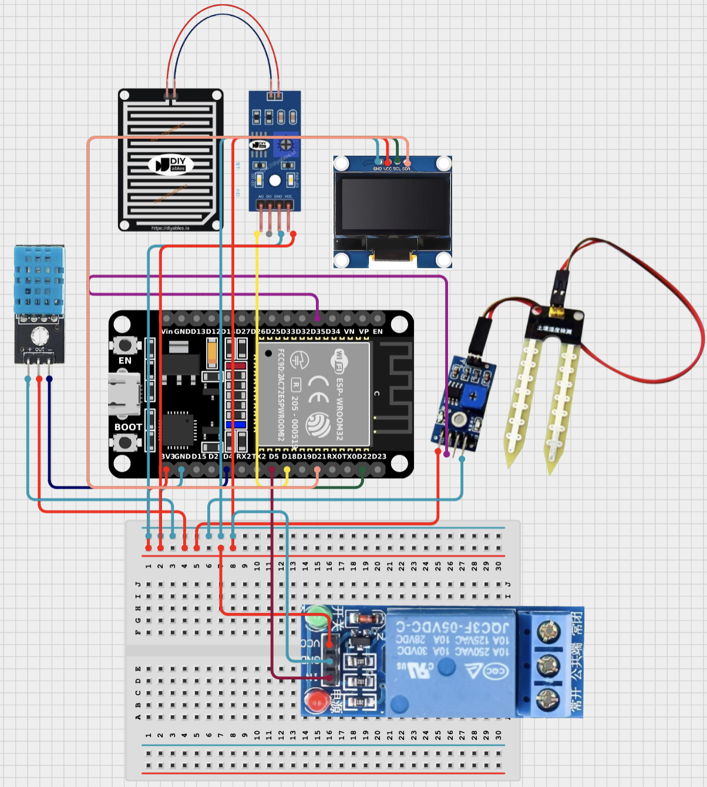

# Smart Irrigation IoT System

A comprehensive smart irrigation system using ESP32 with environmental sensors, automated water pump control, rain detection, and real-time web dashboard.

## Hardware Components

- **ESP32 DevKit**: Main microcontroller
- **DHT11**: Temperature and humidity sensor (GPIO16)
- **Soil Moisture Sensor**: Analog soil moisture detection (GPIO35)
- **MH-RD Rain Sensor**: Digital rain detection (GPIO18)
- **Relay Module**: Water pump control (GPIO17)
- **SSD1306 OLED Display**: 0.96" 128x64 I2C display for local data visualization (SDA: GPIO21, SCL: GPIO22)

## Wiring Diagram

*Complete schematic showing all sensor connections, relay wiring, and OLED display integration for the ESP32-based smart irrigation system.*

## Features

- Real-time sensor monitoring (temperature, humidity, soil moisture, rain detection)
- Automated water pump control based on soil moisture and temperature thresholds
- Local OLED display showing current sensor readings and system status
- Cloud database integration with Supabase PostgreSQL
- Modern web dashboard with real-time data visualization
- Relay activity logging with environmental context
- Rain detection with override capabilities
